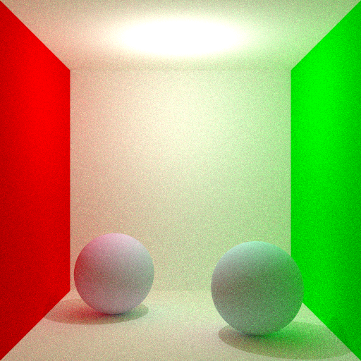

# Informática Gráfica

Repositorio para la realización del primer trabajo de la asignatura **30231 · Informática Gráfica**  
**Escuela de Ingeniería y Arquitectura (EINA) - Universidad de Zaragoza**  
**Curso 2025-2026**

El proyecto implementa un **motor de renderizado por trazado de rayos**, junto con módulos de **geometría**, **procesado de imagen** y una batería extensa de **tests automáticos** ejecutados con CTest.




---

## Estructura del proyecto

```text
.
├── build/                  # Directorio de build (generado)
├── CMakeLists.txt          # Configuración principal del proyecto y ejecución de tests
├── data/                   # Recursos externos (imágenes, texturas...)
│   ├── images/
│   ├── models/
│   └── textures/
├── include                 # Cabeceras públicas organizadas por módulo
│   ├── geometry/
│   ├── imaging/
│   └── sensor/
├── scripts/                # Scripts de compilación y limpieza
│   ├── compiler_cleaner.sh
│   └── compiler.sh
├── src/                    # Implementaciones de cada módulo
│   ├── geometry/
│   ├── imaging/
│   └── sensor/
└── tests/                  # Tests automáticos para probar los módulos
    ├── imaging/
    └── sensor/
```

---

## Módulos principales

| Módulo | Descripción |
| :--- | :--- |
| **geometry/** | Tipos y operaciones geométricas: puntos, rayos, esferas, planos, transformaciones. |
| **imaging/** | Lectura, escritura y tone mapping de imágenes HDR y LDR. |
| **sensor/** | Núcleo del motor de renderizado: escena, cámara pinhole, luces puntuales y trazador recursivo. |

---

## Requisitos

- Compilador **C++20**
- **CMake ≥ 3.15**
- **libpng**
- **OpenEXR** + **Imath**
- **Threads** (biblioteca estándar del sistema)

---

## Compilación y ejecución (forma recomendada)

El proyecto está pensado para usarse mediante el script `compiler.sh`.

Desde la raiz del repositorio:

```bash
./scripts/compiler.sh test # Ejecuta cada uno de los tests
```

---

## Uso de `compiler.sh`

El script automatiza la configuración con CMake, la compilación y la ejecución de los tests.

| Comando | Descripción |
| --- | --- |
| `test` | Compila y ejecuta **todos** los tests |
| `test <regex>` | Ejecuta solo los tests cuyo nombre coincida con el regex |
| `list` | Lista los tests disponibles en CTest |
| `rebuild` | Elimina el directorio `build/` y recompila desde cero |
| `install` | Instala el proyecto (`cmake --install`) |
| `clean` | Limpia artefactos de compilación y outputs |
| `help` | Muestra la ayuda del script |

**Ejemplos:**

```bash
# Ejecutar solo los tests que empiecen por T2
./scripts/compiler.sh test T2-*

# Ejecutar todos los tests
./scripts/compiler.sh test

# Listar todos los tests disponibles
./scripts/compiler.sh list

# Ejecutar test específico
./scripts/compiler.sh test <nomTestEnListado>
```

---

## Ejecución interactiva

Si quieres ejecutar un test individual de forma interactiva (que vía terminal te pidan el ancho, alto y nº de rayos por píxel)

```bash
./scripts/compiler.sh rebuild
cd build
./bin/interactivo/T1-01-dif  # O cualquier otro programa del directorio interactivo/
```

---

## Tests y resultados (`output/`)

Cada ejecución genera automáticamente una carpeta con timestamp:

```bash
output/HH_MM_SS-YYYY_MM_DD/
└── sensor/
    ├── T1-01-dif/
    │   ├── output.png
    │   ├── output.exr
    │   └── T1-01-dif.log
    └── ...
```

Cada test se ejecuta en su propia carpeta y deja ahí imágenes y logs.

---

## Autores

- **Jorge Soria Romeo** (<jorgesoriaromeo@gmail.com>)
- **Javier Salafranca**
